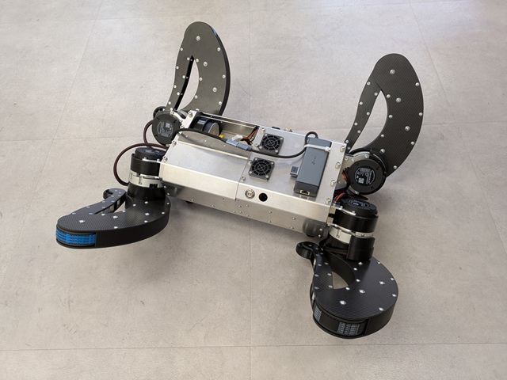
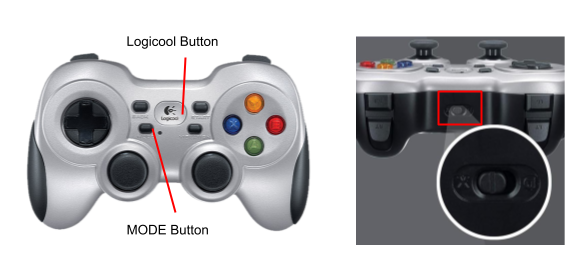
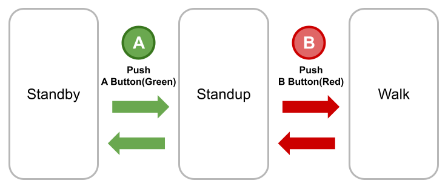
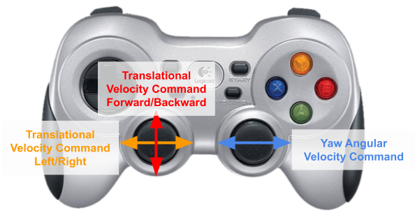

# mujina_ros

## Requirements
- Linux OS
  - Ubuntu Desktop 24.04
- ROS 2
  - [Jazzy Jalisco](https://docs.ros.org/en/jazzy/Installation/Ubuntu-Install-Debs.html)
- Hardware
  - Mujina hardware information is available [here](https://github.com/noriakinakagawa/Mujina_Hardware).
- Recommended Joystick Controllers
  - [Logicool Wireless Gamepad F710](https://gaming.logicool.co.jp/ja-jp/shop/p/f710-wireless-gamepad.940-000144)
  - [Logicool Wired Gamepad F310](https://gaming.logicool.co.jp/ja-jp/shop/p/f310-gamepad.940-000137)
- Recommended USB CAN Device
  - A USB-CAN device that supports [candleLight_fw](https://github.com/rt-net/candleLight_fw) is recommended.


## Build and Install

```
# Clone the mujina_ros repository
mkdir -p ~/mujina_ws/src
cd ~/mujina_ws/src
git clone https://github.com/rt-net/mujina_ros.git

# Install dependencies
rosdep install -r -y -i --from-paths .
python3 -m pip install --break-system-packages mujoco torch torchvision torchaudio onnxruntime

# Build and Install
cd ~/mujina_ws/
colcon build --symlink-install
source ~/mujina_ws/install/setup.bash

# Device setup
sudo usermod -aG dialout $USER
# logout and login to reload user group
sudo cp ~/mujina_ws/src/mujina_ros/mujina/config/90-mujina.rules /etc/udev/rules.d/ # Please edit the file to match your device.
sudo udevadm control --reload
```

## Reinforcement Learning
For reinforcement learning with Isaac Lab, please refer to [this blog post](https://rt-net.jp/mobility/archives/28025).

The Isaac Lab project for Mujina is available [here](https://github.com/rt-net/mujina_isaac_lab).

## Setting the Initial Position
Before first use, set the motor origin:
1. Move each joint to its origin position.
2. Set the joint origin by running the following commands:
```
cd ~/mujina_ws/src/mujina_ros
./mujina_control/scripts/can_setup_net.sh
python3 mujina_control/scripts/motor_set_zero_position.py --ids 1
```



## Usage

To test the installation, run:
```
cd ~/mujina_ws/src/mujina_ros
python3 -m mujina_control.mujina_utils.mujina_utils
```

To test the motors, run:
```
cd ~/mujina_ws/src/mujina_ros
./mujina_control/scripts/can_setup_net.sh
python3 mujina_control/scripts/motor_test_read_only.py --ids 1
```

To test the real robot, run the following commands:
```
# On the Mujina PC
## Terminal 1: 
source ~/mujina_ws/install/setup.bash
ros2 run rt_usb_imu_driver rt_usb_imu_driver --ros-args -p "port_name:=/dev/rt_usb_imu"

## Terminal 2: 
source ~/mujina_ws/install/setup.bash
cd ~/mujina_ws/src/mujina_ros
./mujina_control/scripts/can_setup_net.sh
ros2 run mujina_control mujina_main

## Terminal 3: 
source ~/mujina_ws/install/setup.bash
ros2 run joy_linux joy_linux_node
```

For the recommended gamepad:  
Set the control mode slider to the X position and press the MODE button until the LED turns off.



Green button: Sit Down / Stand Up. Red button: Stand Up / Walk.  
Left and Right Joysticks: Send commands in Walk mode.  




To simulate the robot in Mujoco, run the following command in Terminal 2 instead:
```
ros2 run mujina_control mujina_main --sim
```

To create a CAN network interface from a serial port, run the following command in Terminal2 instead:
```
./mujina_control/scripts/can_setup_serial.sh
```

## Acknowledgements
- This package is forked from [haraduka/mevius](https://github.com/haraduka/mevius) and [CoRE-MA-KING](https://github.com/CoRE-MA-KING/mevius)
- The STL files and physical properties in [mujina_description](./mujina_description) and [mujina.xml](./mujina_control/models/mujina.xml) are based on CAD models from [Mujina_Hardware](https://github.com/noriakinakagawa/Mujina_Hardware).
  - We have obtained permission from Noriaki Nakagawa to use the CAD models.
- [motor_lib.py](./mujina_control/mujina_control/motor_lib/motor_lib.py) is from [mini-cheetah-tmotor-python-can](https://github.com/dfki-ric-underactuated-lab/mini-cheetah-tmotor-python-can)
- [isaacgym_torch_utils.py](./mujina_control/mujina_control/mujina_utils/legged_gym_math/isaacgym_torch_utils/isaacgym_torch_utils.py) is from [IsaacGymEnvs](https://github.com/isaac-sim/IsaacGymEnvs)
- [legged_gym_math.py](./mujina_control/mujina_control/mujina_utils/legged_gym_math/legged_gym_math.py) is from [LeggedGym](https://github.com/leggedrobotics/legged_gym)
